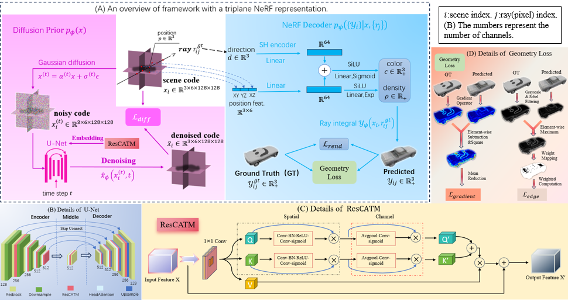

# GeoDiff-RTM: Unified 3D Reconstruction and Generation via Geometry Constrained Diffusion with Residual Token Mixing

An improved version based on [SSDNeRF](https://github.com/Lakonik/SSDNeRF), incorporating **ResCATM ** and **Geometry Loss** to enhance the quality of single-view 3D reconstruction and unconditional 3D generation.

---
## Overall framework：GeoDiff-RTM



##  Key Improvements

| Module | Description |
|--------|-------------|
| **ResCATM** | A residual cross-attention module embedded in the U-Net denoising network to enhance geometric correlations among tri-plane features |
| **Edge Loss** | A Sobel-based edge-aware weighted loss to sharpen object contours |
| **Gradient Loss** | A gradient-based consistency constraint to recover surface texture details |

---

##  Environment Setup

### Prerequisites

The code has been tested in the environment described as follows:

- Linux (tested on Ubuntu 18.04/20.04 LTS)
- Python 3.8
- [CUDA Toolkit](https://developer.nvidia.com/cuda-toolkit-archive) 11
- [PyTorch](https://pytorch.org/get-started/previous-versions/) 1.12.1
- [MMCV](https://github.com/open-mmlab/mmcv) 1.6.0、。
- [MMGeneration](https://github.com/open-mmlab/mmgeneration) 0.7.2

Also, this codebase should be able to work on Windows systems as well (tested in the inference mode).

Other dependencies can be installed via `pip install -r requirements.txt`. 

An example of commands for installing the Python packages is shown below:

```bash
# Export the PATH of CUDA toolkit
export PATH=/usr/local/cuda-11.3/bin:$PATH
export LD_LIBRARY_PATH=/usr/local/cuda-11.3/lib64:$LD_LIBRARY_PATH

# Create conda environment
conda create -y -n GeoDiff-RTM python=3.8
conda activate GeoDiff-RTM 

# Install PyTorch (this script is for CUDA 11.3)
conda install pytorch==1.12.1 torchvision==0.13.1 torchaudio==0.12.1 cudatoolkit=11.3 -c pytorch

# Install MMCV and MMGeneration
pip install -U openmim
mim install mmcv-full==1.6
git clone https://github.com/open-mmlab/mmgeneration && cd mmgeneration && git checkout v0.7.2
pip install -v -e .
cd ..

# Clone this repo and install other dependencies
git clone <this repo> && cd <repo folder>
pip install -r requirements.txt
```
### Compile CUDA packages

There are two CUDA packages from [torch-ngp](https://github.com/ashawkey/torch-ngp) that need to be built locally.

```bash
cd lib/ops/raymarching/
pip install -e .
cd ../shencoder/
pip install -e .
cd ../../..
```


## Data preparation

Download `srn_cars.zip` and `srn_chairs.zip` from [here](https://drive.google.com/drive/folders/1PsT3uKwqHHD2bEEHkIXB99AlIjtmrEiR).
Unzip them to `./data/shapenet`.

Download `abo_tables.zip` from [here](https://drive.google.com/file/d/1lzw3uYbpuCxWBYYqYyL4ZEFomBOUN323/view?usp=share_link). Unzip it to `./data/abo`. For convenience I have converted the ABO dataset into PixelNeRF's SRN format.

If you want to try single-view reconstruction on the real KITTI Cars dataset, please download the official [KITTI 3D object dataset](http://www.cvlibs.net/datasets/kitti/eval_object.php?obj_benchmark=3d), including [left color images](http://www.cvlibs.net/download.php?file=data_object_image_2.zip), [calibration files](http://www.cvlibs.net/download.php?file=data_object_calib.zip), [training labels](http://www.cvlibs.net/download.php?file=data_object_label_2.zip), and [instance segmentations](https://github.com/HeylenJonas/KITTI3D-Instance-Segmentation-Devkit).


Extract the downloaded archives according to the following folder tree (or use symlinks).

```
./
├── configs/
├── data/
│   ├── shapenet/
│   │   ├── cars_test/
│   │   ├── cars_train/
│   │   ├── cars_val/
│   │   ├── chairs_test/
│   │   ├── chairs_train/
│   │   └── chairs_val/
│   ├── abo/
│   │   ├── tables_train/
│   │   └── tables_test/
│   └── kitti/
│       └── training/
│           ├── calib/
│           ├── image_2/
│           ├── label_2/
|           └── instance_2/
├── demo/
├── lib/
├── tools/
…
```

For FID and KID evaluation, run the following commands to extract the Inception features of the real images. (This script will use all the available GPUs on your machine, so remember to set `CUDA_VISIBLE_DEVICES`.)

```bash
CUDA_VISIBLE_DEVICES=0 python tools/inception_stat.py configs/paper_cfgs/cars_uncond.py
CUDA_VISIBLE_DEVICES=0 python tools/inception_stat.py configs/paper_cfgs/chairs_recons1v.py
CUDA_VISIBLE_DEVICES=0 python tools/inception_stat.py configs/paper_cfgs/abotables_uncond.py
```

For KITTI Cars preprocessing, run the following command.

```bash
python tools/kitti_preproc.py
```

## About the configs

### Naming convention
    
```
cars_uncond
    │   └── testing data: test unconditional generation
    └── training data: train on Cars dataset, using all views per scene

cars_recons1v
   │      └── testing data: test 3D reconstruction from 1 view
   └── training data: train on Cars dataset, using all views per scene
   
```
##  Training

### Reconstruction

```bash
python train.py configs/new_cfgs/cars_recons1v_16bit.py --gpu-ids 0 1
```

#### With Edge Loss

Enable `edge_loss` in the config file:

```python
# configs/new_cfgs/cars_recons1v_16bit.py
model = dict(
    # ...existing code...
    edge_loss=dict(
        type='EdgeLoss',
        loss_weight=3,
        edge_threshold=0.1,
        reduction='mean'
    ),
    # ...existing code...
)
```

#### With Gradient Loss

Enable the `normal_loss` option, which is the gradient loss option, in the configuration file:

```python
# configs/new_cfgs/cars_recons1v_16bit.py
model = dict(
    # ...existing code...
    normal_loss=dict(
        type='NormalLoss',
        loss_type='consistency',
        loss_weight=10.0
    ),
    # ...existing code...
)
```


Enable ResCATM  :
```python
# configs/new_cfgs/cars_uncond_16bit.py
model = dict(
    # ...existing code...
    diffusion=dict(
        # ...existing code...
        denoising=dict(
            # ...existing code...
            use_catm=True,
            catm_positions=['down', 'mid', 'up'],
            catm_start_level=1,
        ),
        )
        # ...existing code...
    
)
```

### Unconditional Generation

```bash
python train.py configs/new_cfgs/cars_uncond_16bit.py --gpu-ids 0 1
```


##  Testing

###  Reconstruction

```bash
python test.py configs/new_cfgs/cars_recons1v_16bit.py work_dirs/YOUR_CHECKPOINT.pth --gpu-ids 0 1
```

### Unconditional Generation

```bash
python test.py configs/new_cfgs/cars_uncond_16bit.py work_dirs/YOUR_CHECKPOINT.pth --gpu-ids 0 1
```


##  Visualization Tools

### Edge Loss Visualization

```bash
python tools/visualize_edge_loss.py
```

### Gradient Loss Visualization

```bash
python tools/visualize_gradient_loss.py
```

> Please modify the image path at the top of each script before running.


##  Acknowledgements

This project is built upon [SSDNeRF](https://github.com/Lakonik/SSDNeRF). 
The design of ResCATM is inspired by [CAS-ViT](https://github.com/Tianfang-Zhang/CAS-ViT). We thank the original authors for their open-source contributions.

### Training Time Reference

> All experiments were conducted on **2 × NVIDIA RTX 3090 (24GB) GPUs**.

|            Task              | Dataset  | Iterations | Training Time |
|------|---------|-----------|--------------|
| Single-view Reconstruction | SRN Cars | 60,000 | ~10 hours |
| Single-view Reconstruction | SRN Chairs | 60,000 | ~15 hours |
| Unconditional Generation | SRN Cars | 500,000 | ~5-6 days |
| Unconditional Generation | ABO Tables | 500,000 | ~5-6 days |


